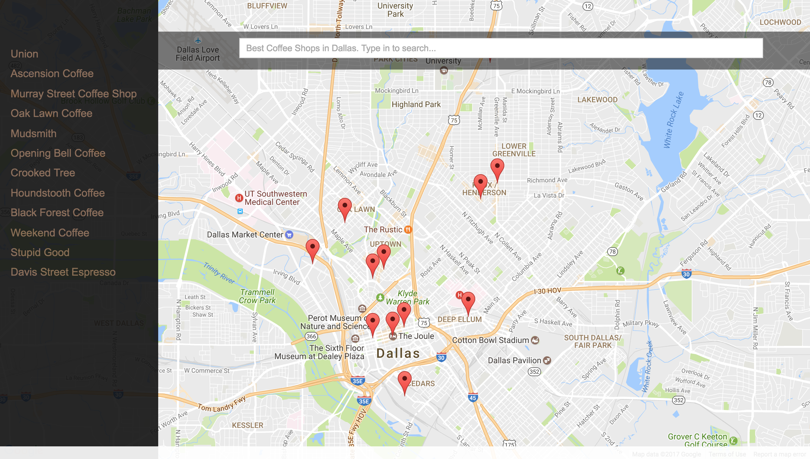

## Neighborhood Map project
### Best Coffee Shops in Dallas
#### Project Overview
In this project, I developed a single page application featuring a map of 12 high rated coffee shops in Dallas Neighborhood.

Technology Used: HTML, CSS, bootstrap, JavaScript, jQuery, Ajax, knockoutJS, Google Maps API, Yelp API, and Gulp.

Run the App from here: https://jerryluo1989.github.io/Neighborhood-Map/dist/index.html

#### Desktop User
- Design:
  * A shop list on the left
  * Search bar floating on the map
  * Maker window. Including the shops' name, address, phone number and Yelp link/reviews.
- How to use:
  * User can search the shops in the search bar anytime. Shops in the list and map will be filtered as user types in.
  * When click the marker or the shop name in the list or press ENTER after searching, the selected shop will be centered and zoomed in, with Marker window popping up.

#### Mobile User
- Design:
  * A hamburger icon. This will trigger the hidden shop list
  * Search bar floating on the map
  * Bottom card. Including the shops' name, address, phone number and Yelp link/reviews.
- How to use:
  * User can search the shops in the search bar anytime. Shops in the list and map will be filtered as user types in.
  * When click the marker or the shop name in the list or press ENTER after searching, the selected shop will be centered and zoomed in, with Bottom card popping up.

